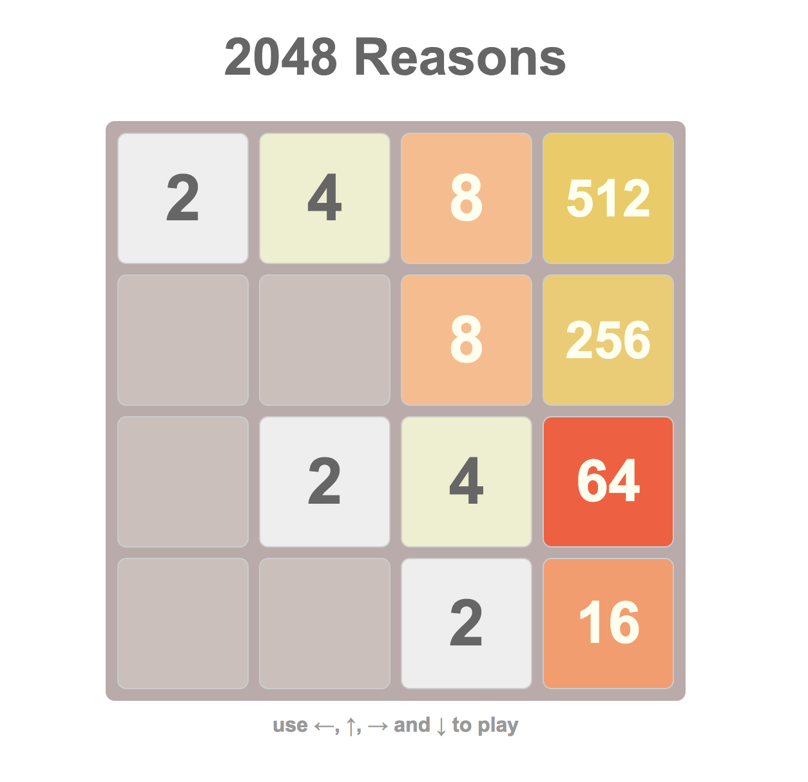

# 

A `Functional Programming` approach to the viral [2048 Game](https://gabrielecirulli.github.io/2048/). 
Implemented in [Reason](https://reasonml.github.io/) and [ReasonReact](https://reasonml.github.io/reason-react/) with a simplified user experience and a fair amount of tests.

check out the [demo](https://alanrsoares.github.io/2048-reasons/)

## License
MIT
